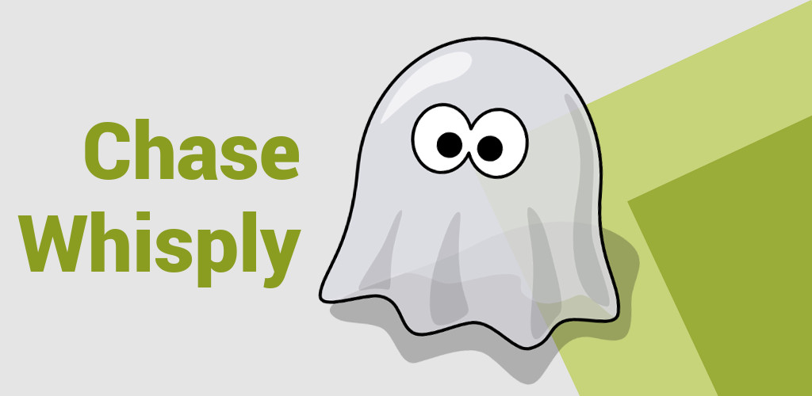
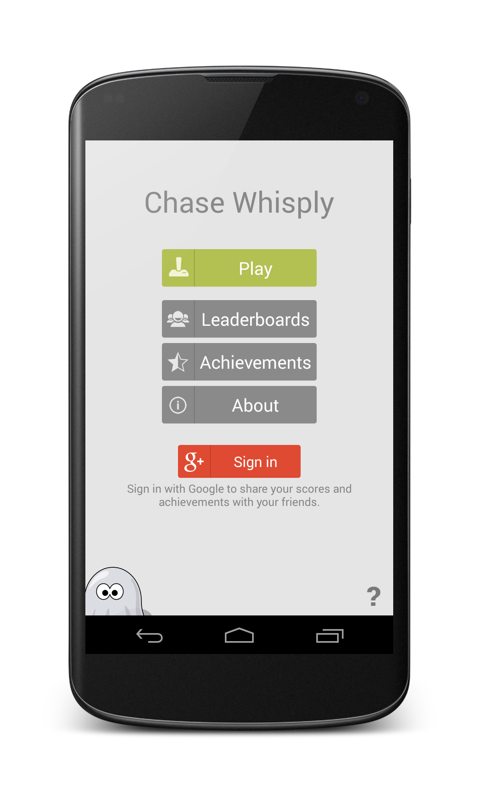
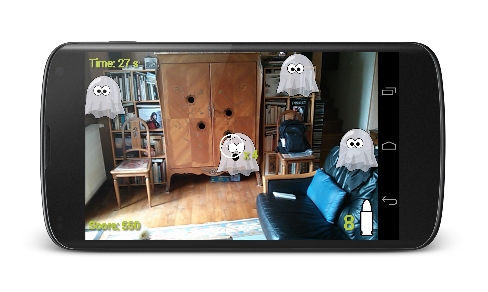

Beta Test V2.3
========
The beta 2.3 is out! Join the [Community](https://plus.google.com/communities/104127077976914732043) and download the application! 

Bug Fix
* no more ghosts should be untargetable
* display an error message when no sensors are retrieved

Modification
* reloading time has been reduces (from 1500 ms to 1000ms)
* you can find the names of some beta testers who really helped us. i > Thanks to
* add two "uses-feature" : accelerometer & compass
* the profil has its own activity

New Content
* a drop system with 3 loots : Old Coin, Broken Helmet Horn and Baby Drool
* a craft system with 2 items : Steel Bullet and Gold Bullet
* the inventory section of the game is now fully implemented: Profil > Inventory You can manage all your items!
* you can change the sensor delay! i > Sensor Delay button
* you can now use some bonuses - that you crafted - to be a stronger hunter
* 3 new achievements (Novice, Trained and Expert Looter) they should be very easy with the current drop rates.

Note
* drop rates are very high for beta test purpose only

ChaseWhisplyProject
========
Chase Whisply is an "augmented reality" FPS. You have to seek, find and kill the ghosts living around you.

In Game
========

Credits and License
========
Credits go to Thomas Barthélémy [https://github.com/tbarthel-fr](https://github.com/tbarthel-fr) and Vincent Barthélémy [https://github.com/vbarthel-fr](https://github.com/vbarthel-fr).

Licensed under the Beerware License:

<pre>
You can do whatever you want with this stuff.
If we meet some day, and you think this stuff is worth it, you can buy us a beer (or basically anything else) in return.
</pre>

Special Thanks to ...
========
Thomas Keunebroek [https://github.com/tkeunebr](https://github.com/tkeunebr) , for his early day support and precious advice.
